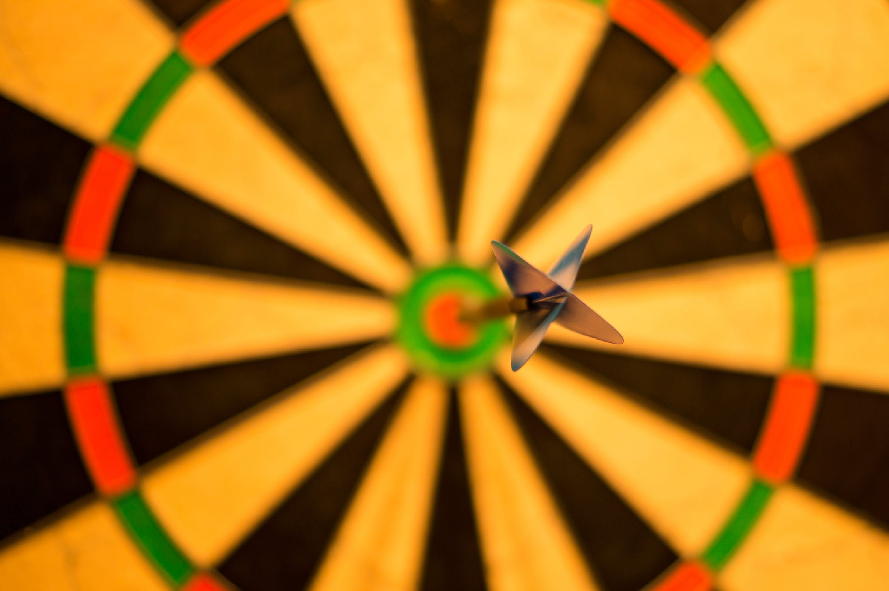
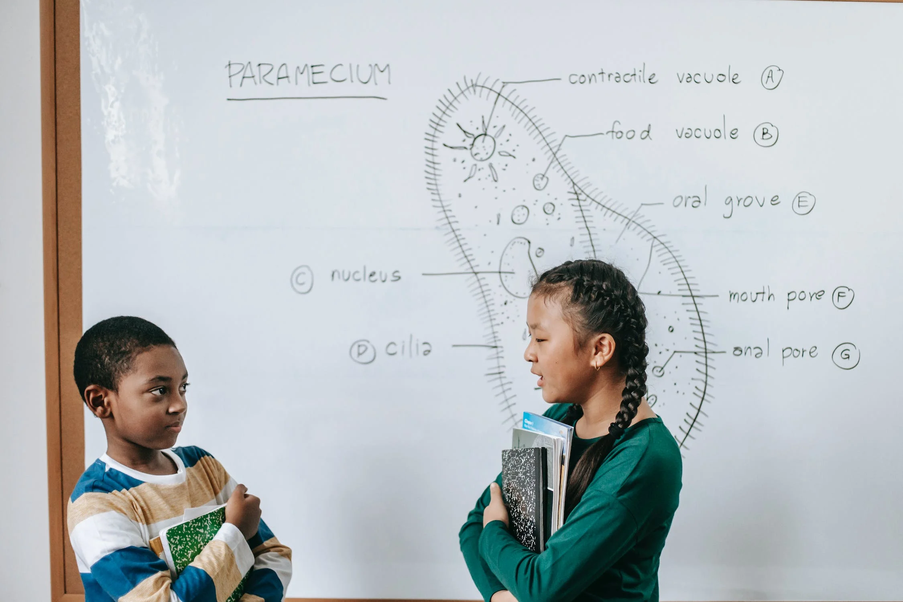
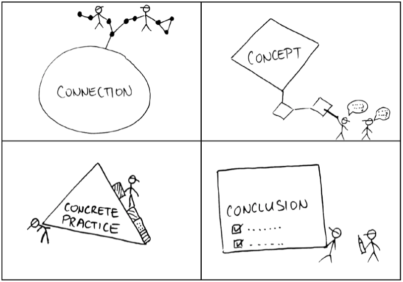
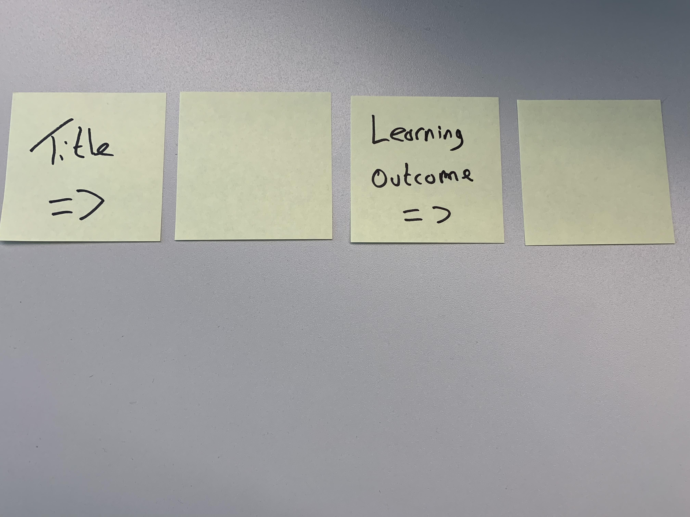
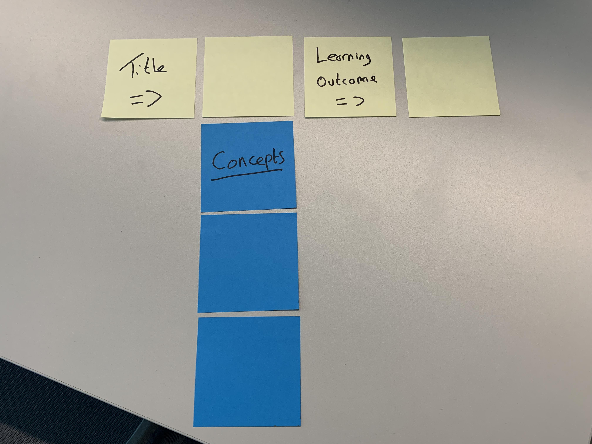
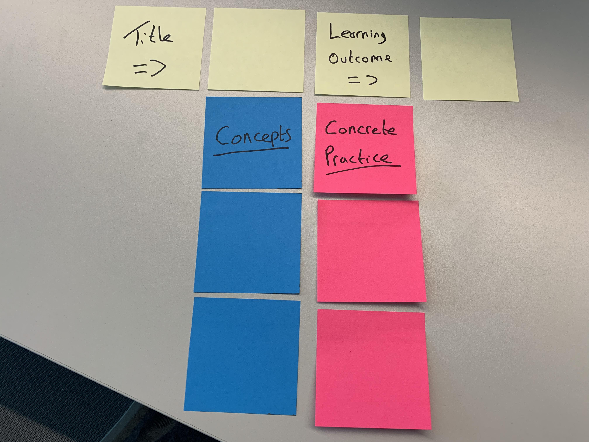
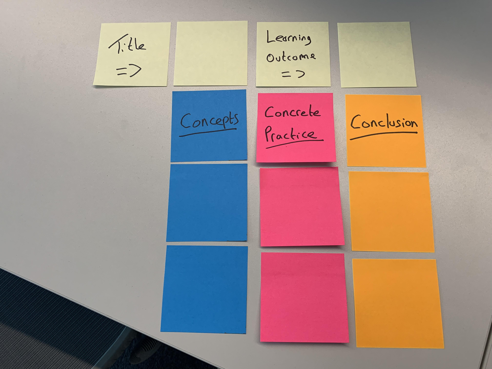
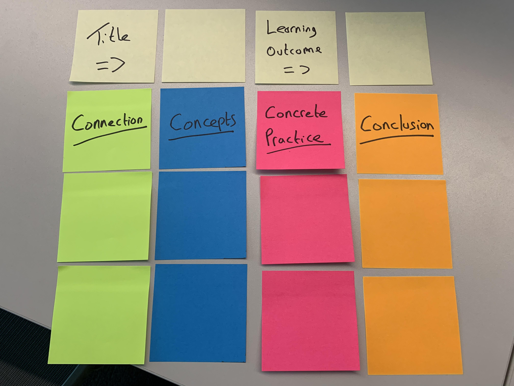

bbr# What do learners spend most of their time on during your training programs?

1. Reading the text, handouts, slides or manuals
1. Listening to you
1. Watching visuals on slides or screens
1. Discussing concepts or practicing skills
1. Teaching each other and learning from each other

---

## Trainers train; learners listen

---

## Why do we do this?

---

> "The brain research from the past two decades proves that human beings learn best when they are actively involved in the learning process – experiencing a variety of meaningful, motivating, self directed learning methods in an informal, hands-on learning environment"

– Sharon Bowman

---

## Shift the paradigm

_Trainers_ **talk**; _learners_ **listen**

->

When _learners_ **talk** and **teach**, they learn

---

## Which do you prefer?

_"Let's begin by brainstorming at least a half-dozen facts you already know about this topic"_

vs

_"I'm going to begin by telling you what you are going to learn about this topic"_

---

# Exercise _(in fours)_

Group by **effective** and **ineffective**. Choose between:

- **Effective openings**: _Link learners to learners, and learners to the topic_
- **Effective practices**: _Have learners do an active skills practice or active review of content_

---

# Effective Openings

### Link learners to learners, and learners to the topic

---

## O1. The trainer begins by stating their background, experience and credentials

---

## O1. The trainer begins by stating their background, experience and credentials

---

## O2. Learners listen while the trainer talks about the goals of the session

---

## O2. Learners listen while the trainer talks about the goals of the session

---

## O3. In standing groups, learners discuss what they want to learn from the training

---

## O3. In standing groups, learners discuss what they want to learn from the training

---

## O4. Learners read the slides that state the learning outcomes of the training

---

## O4. Learners read the slides that state the learning outcomes of the training

---

### O5. The trainer directs learners to gather around a chart listing the learning outcomes. They read the list together, and then each puts their initials beside the outcome they feel is most important

---

### O5. The trainer directs learners to gather around a chart listing the learning outcomes. They read the list together, and then each puts their initials beside the outcome they feel is most important

---

### O6. Learners write the learning outcomes on a note-taking page, then check off the ones they consider important. Each tells another person what they checked, and then refers to the page again at the end of the training to review what was learned

---

### O6. Learners write the learning outcomes on a note-taking page, then check off the ones they consider important. Each tells another person what they checked, and then refers to the page again at the end of the training to review what was learned

---

## O7. The trainer states the learning outcomes, agenda, and miscellaneous announcements

---

## O7. The trainer states the learning outcomes, agenda, and miscellaneous announcements

---

### O8. Learners form small collaborative groups and discuss what they already know about the topic and any questions they have that are related to the topic

---

### O8. Learners form small collaborative groups and discuss what they already know about the topic and any questions they have that are related to the topic

---

### O9. With partners, learners make lists of topic-related facts they already know. Then they share their lists with other peers

---

### O9. With partners, learners make lists of topic-related facts they already know. Then they share their lists with other peers

---

# Effective practices

### Have learners do an active skills practice or active review of content

---

## P1. Participants sit and watch a video demonstration of the computer database entry steps they need to follow

---

## P1. Participants sit and watch a video demonstration of the computer database entry steps they need to follow

---

## P2. At a safety meeting, and with real equipment, each learner teaches another learner how to safely set up, hold, climb, and dismount a ladder

---

## P2. At a safety meeting, and with real equipment, each learner teaches another learner how to safely set up, hold, climb, and dismount a ladder

---

## P3. Paired at computer stations, participants take turns practising the steps for creating a new spreadsheet while their partners coach and advise them

---

## P3. Paired at computer stations, participants take turns practising the steps for creating a new spreadsheet while their partners coach and advise them

---

## P4. One person from each of the two teams competes for points in a review game while the other team members watch the competition

---

## P4. One person from each of the two teams competes for points in a review game while the other team members watch the competition

---

## P5. In an insect abatement class, learners take a written test about how to check for termite infestation

---

## P5. In an insect abatement class, learners take a written test about how to check for termite infestation

---

## P6. In a retail outlet training, participants watch someone demonstrate how to operate the cash registers

---

## P6. In a retail outlet training, participants watch someone demonstrate how to operate the cash registers

---

## P7. With a partner, each learner roleplays what to say and do if a customer is dissatisfied

---

## P7. With a partner, each learner roleplays what to say and do if a customer is dissatisfied

---

## P8. All learners read through the employee guide to learn call centre procedures

---

## P8. All learners read through the employee guide to learn call centre procedures

---

## P9. The trainer asks whether the learners have any questions

---

## P9. The trainer asks whether the learners have any questions

---

# Teach Back _(in pairs)_

- One person talks, the other listens
- After one minute switch roles

## Explain why you should make brain friendly learning?

---

# Discussion  _(at your table)_

## How do you design your training workshops?

---

> We are not, cannot be, about designing content. A fundamental perspective I want you to take away is that we are designing experiences

– Clark Quinn - Engaging Learning (2005)

---

# The 4Cs

---

# The 4 Cs

- Connections _(share what they already know)_
- Concepts _(direct instruction)_
- Concrete Practice _(active practice)_
- Conclusions _(summarise learning)_

---

# Exercise  _(in pairs)_

## Write up your next workshop using 4Cs

---

<!-- .slide: data-background="./images/c1.jpg" -->

---

# Learning Outcomes

**Action Word (observable behavior) + Concept/Skill**

- Bad: _know / understand / learn_
- Good: _demonstrate / explain / list / define  show / apply / use / act / solve   do / discuss / perform_

---

---

# Concepts

**direct instruction**

Learners take in new information in multisensory ways: hearing, seeing, discussing, writing, reflecting, imagining,
participating, and teaching it to others

---

---

# Concrete Practice

**active practice**

Learners actively practice a skill using the new information, or they participate in an in depth, active review of what they have learned.

---

---

# Conclusion

**summarise learning**

Learners summarize what they have learned, evaluate it, celebrate it, and create action plans for how they plan to use it after the class is over.

---

---

# Connection

**share what they already know**

Learners make connections with what they already know or think they know about the topic, with what they will learn or want to learn, with each other, and with the instructor.

---

# Activity _(fours)_

### Share your instructional design with a neighbouring pair

---

# Activity  _(solo)_

### Write down five things you've learned on an index card

### **You have one minute**

---

# **Thank You!**

### https://bowperson.com/sharons-articles/

