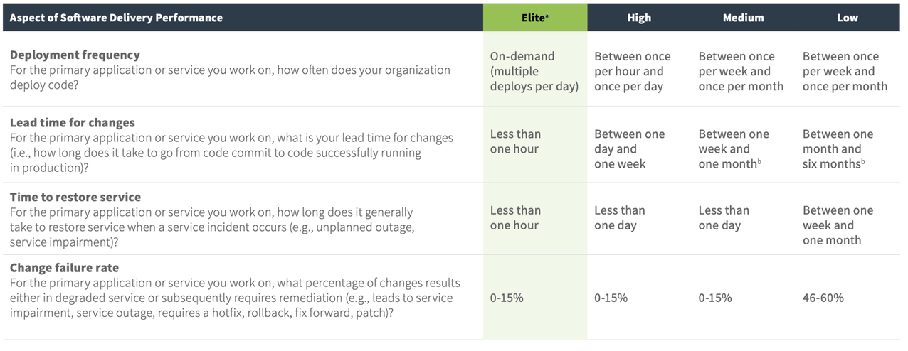
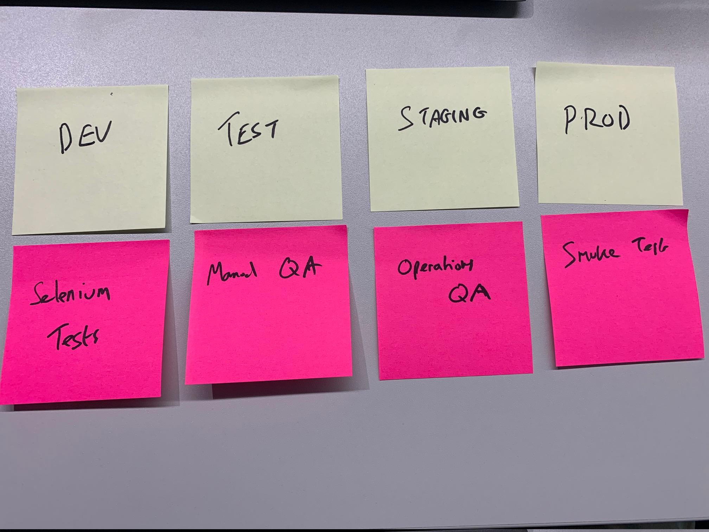

# Non-prod environments  are a lie

---

# Quick survey

---

# Quick survey

- How many of you think I'm mad and only came to DevCoP to see me get sectioned?

---

# Quick survey

- How many environments do you go through before changes hit production?

---

# Quick survey

- How many of you have a dashboard that alerts to previous issues (HTTP 5xx etc.)

---

# Quick survey

- How many are capturing errors thrown inside the web browser/client?

---

# Quick survey

- How many of you have observability tools set up?

---

## 2019 Accelerate DORA report

_Sample size: 31,000 across multiple industries_

---

# We already measure this

_if you are on open shift_

https://openshift-service-perf-ui-ros-infra-prod.apps.live.ocp.ros.local/summary

---

# Optimise for

- Code to production as quickly as possible
- Respond to unexpected incidents quickly

---

# Principles

- Devs should operate their code (and monitor)
- Make deploys easy (no manual steps, small changeset, if you fear your release then spend time fixing that)
- Failure is inevitable - focus on how to learn and respond (incident process)

---

# Why a lie?

- They drift away from prod after a while (firewall rules, capacity)
- They don't get the same traffic profile
- Effort snowballs to maintain them and that work isn't prioritised (like refreshing data)

---

# What to do instead

- Use Continuous Deployment
- Move manual testing to production
- Run a test suite continuously in production
- Create dashboards and predictive alerts for known unknowns
- Add observability for unknown unknowns

---

> Rolling out observability tooling is like turning on the light and putting on your glasses before you start swinging at the pinata - Charity Majors

---

# Observability in action

https://www.honeycomb.io/overview/

---

# This is a sociotechnical problem

---

# Exercise

## What would you need to do to move to continuous deployment?

---

## Part 1

- Draw your deployment pipeline
- List the automated and manual activities that happen in each environment

---

## Part 2

- How can you safely automate those manual activities, so you don't need manual involvement anymore?
- List these on a different colour sticky

---

## Part 3

- Now move to two environments - dev and prod
- How can you merge those activities?

---

## Review

- What actions do you need to take?

---

# What you need to do

- Use Continuous Deployment
- Move manual testing to production
- Run a test suite continuously in production
- Create dashboards and predictive alerts for known unknowns
- Add observability for unknown unknowns

---

# Non-prod environments  are a lie
