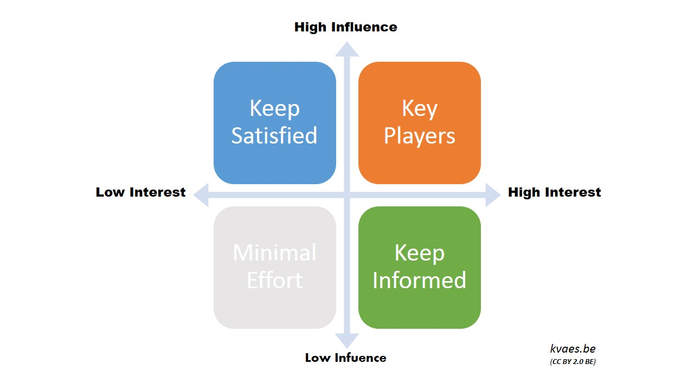

# Stakeholder Mapping

---

## List anyone with a vested interest in your product

 * Individual or group of individuals
 * High level and low level folk affected by the work
 * Might talk rarely to some stakeholders

---

### Consider folk who need

* permission
* process approval
* resources
* engagement
* cooperation

---

## Discuss these questions  about your list

  * Who has a financial interest?
  * Who has an emotional interest?
  * What are each stakeholders motivations?
  * Who are your biggest supports?
  * Who are your biggest nay-sayers?

---

## Map the stakeholders

* Order by influence of stakeholder  (power in changing direction or environment)

---

---

## Review

  * How are we currently communicating with people in each quadrant?
  * How are we doing with our most important stakeholders?
  * What should we do differently?