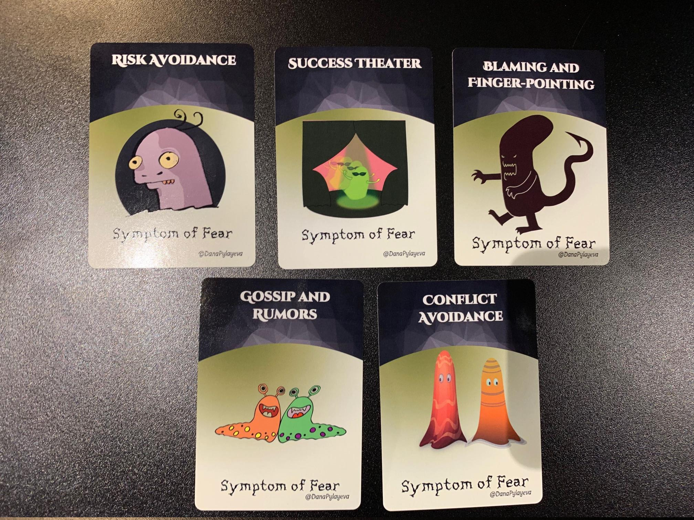
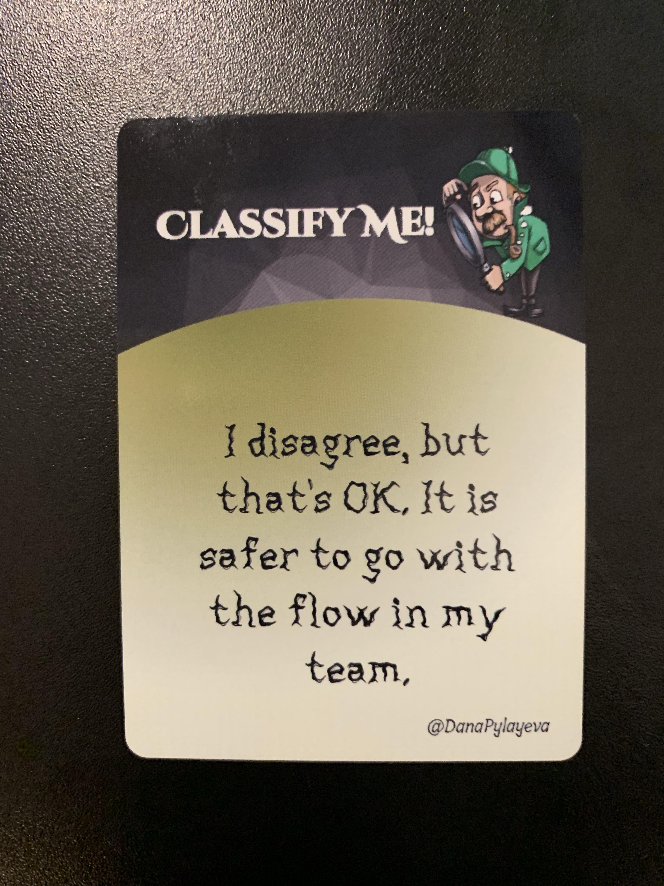
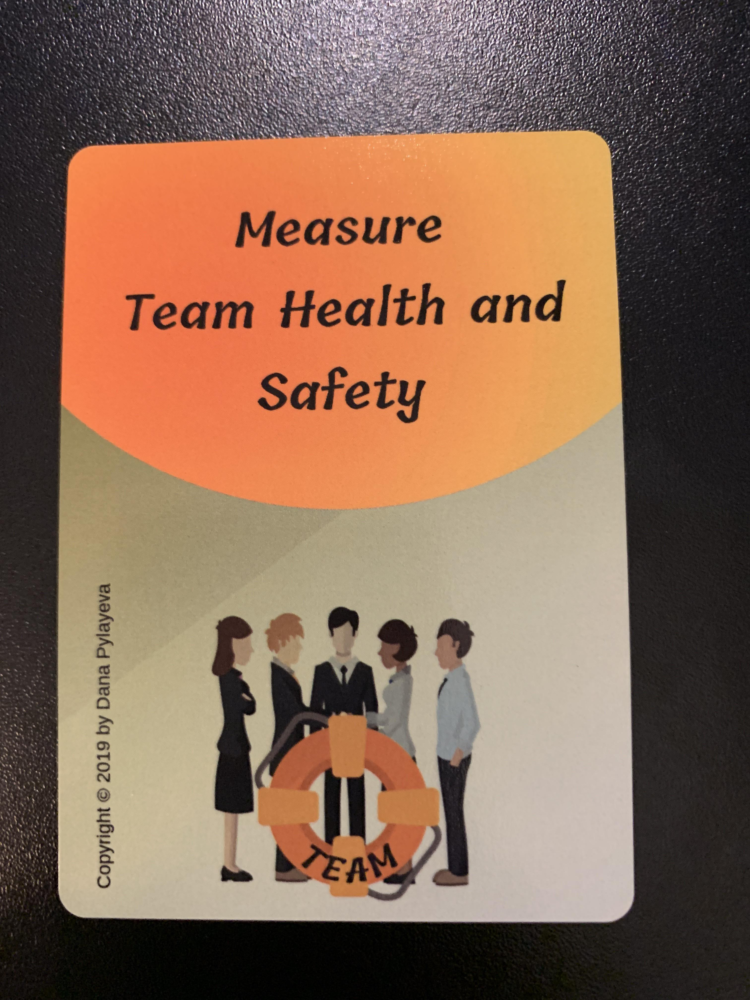

# Fear in the workplace

*(a card game by Dana Pylayeva)*

---

# Why care about fear in the workplace?

<!--

* Kills info flow
* Kill innovation
* Great people leave

-->

---

## It is ok to just observe  or skip an activity

---

### Fear symptoms

---

# Exercise time!

## Identify the fear

*(in groups of six)*

---

## Classification cards

---

### How to play

* Deal out all the the fear cards
* One person plays a "classify me" card
* Each person plays a fear card face down which they think matches the scenario best
* Discuss the scenario and fear cards as a group
  * How often do you see this in your workplace?
* The person who played a "classify me" decides which one is the best fit
* Continue until out of fear cards

---

# Activity

## Choose the top __three__ fear cards you see in your workplace

---

# Activity

## Discuss what you already know about psychological safety

*(in groups of three)*

---

### Psychological safety

> Psychological safety exists when people feel their workplace is an environment where they can __speak up__, __offer ideas__, __ask questions__ without fear of being punished or embarrassed

Amy Edmunson "The Fearless Organisation" (2018)

---

### Fear is a virus

> How you manage your own fear will either calm things down or further rev things up 

Harriet Lerner "The Dance Of Fear" (2004)

---

## Eradication strategies

How might we do this?

---

# Exercise time!

## Build an eradication strategy

*(in groups of six)*

---

### How to play

* Place the safety cards face up on the table sorted by their type
* Discuss each fear card in turn for eight minutes, looking to see which safety cards could help
* Choose a leadership, team and individual card to match each fear
* Decide the easiest card you could start with
* Move onto the next fear

---

## What were your fear eradication strategies?

---

# Activity!

Write down your 'A-ha!' moment onto a post-it note

---

# Fear in the workplace

*(a card game by Dana Pylayeva)*