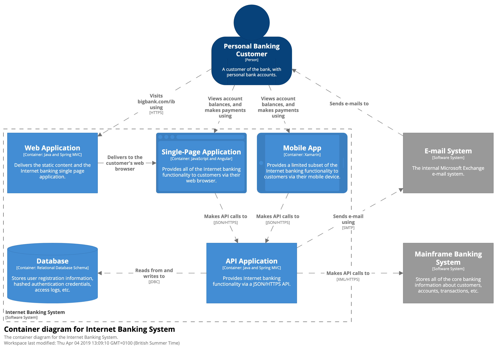

## Create one (or more) diagrams to explain your system

*(you have 15 minutes)*

---

## Diagrams should be able to stand alone. Narrative should complement, rather than explain it.

*otherwise...*

* "We’ll talk through the diagrams."
* "This doesn’t make sense, but we’ll explain it during the presentation."

---

### Common diagram problems

* Notation (e.g. colour coding, shapes, etc) is not explained or is inconsistent.
* The purpose and meaning of elements is ambiguous.
* Relationships between elements are missing or ambiguous.
* Generic terms such as “business logic” are used.
* Technology choices (or options, if doing up front design) are omitted.
* Levels of abstraction are mixed.
* Too much or too little detail.
* No context or a logical starting point.

---

### When a collection of diagrams are created. These problems arise:

* The notation (colour coding, line styles, etc) is not consistent between diagrams.
* The naming of elements is not consistent between diagrams.
* The logical order in which to read the diagrams isn’t clear.
* There is no clear transition between one diagram and the next.

---

## Lines

* Directionality: Most significant direction, initiator to receiver, text description helps with this
* Description: end with a preposition (ends with: from, to, on, in). Read it aloud including the from and to boxes.
* Line Style: Sync solid, Aysnc dotted, https(green) http(amber)
* One line vs Many: Can use multiple if it helps

---

## Shneiderman’s mantra

* Overview first 
* zoom and filter
* then details-on-demand

---

## Shneiderman’s mantra (with C4)

* Overview first (context & container)
* zoom and filter (component)
* then details-on-demand (code)

---

## Simon Brown's C4 Model version

* Context: High level to set the scene. Key system deps and people
* Container: High level tech choices, their responsibilities, how they communicate
* Component: Key logical components and their relationships
* Code: UML diagrams

---

# Context diagrams

---

---

## Context Diagrams

* __Intent__: what is it? Who is it for? How does it fit in with the existing env?
* __Structure__: People (roles, personas), your box, key dependenices - for non-technical people
* __Elements__: People (name/user/persona & description/role/responsibilities) & Software Systems (name & short description of it's responsibilities. External/Internal system). External systems are ones which you don't own or run.

---

## Context Diagrams

* __Interactions__: Every interaction needs annotated - otherwise ambigious lines
* __Advantages__: Explicit scope (no assumptions), how it fits in the your env, non-technical, shows who to talk to for
* __Audience__: Tech and Non-Tech

---

## Draw a context diagram for your system

*(you have 10 minutes)*

---

# Container diagrams

---

---

---

## Container Diagrams

* __Intent__: What are the high level tech choices? How are resposbilities distributed? How does communication work? Where do I add features as a dev?
* __Structure__: Containers (Web Application, Relational DB, Filesystem)
* __Elements__: People (same as before), Software Systems, Containers (name, tech, description(responsibilties/entities for db))

---

## Container Diagrams

* __Interactions__: Purpose (writes, reads, sends), Mechanism (REST, SOAP, protobuf), Style (sync,async,batch), Protocols/PortNo (http, smtp)
* __Advantages__: High level tech choices are explicit, relationships and communication styles are shown
* __Audience__: Dev, Ops, Support staff

---

## Draw a context diagram for your system

*(you have 15 minutes)*

---

## https://c4model.com/

---