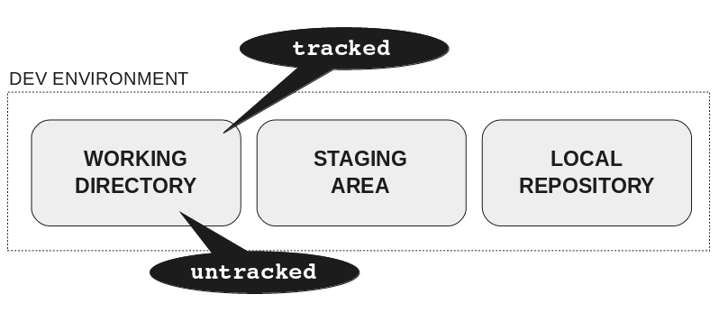
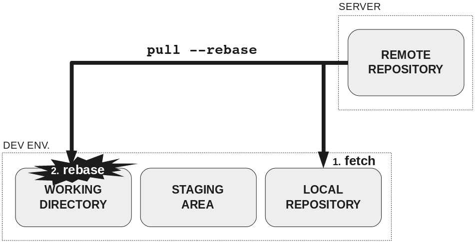
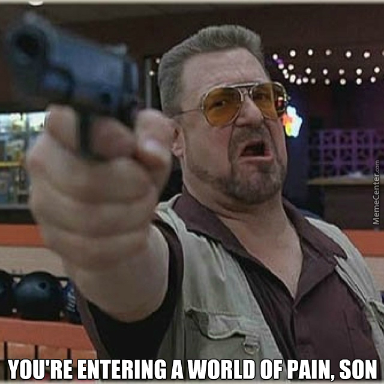
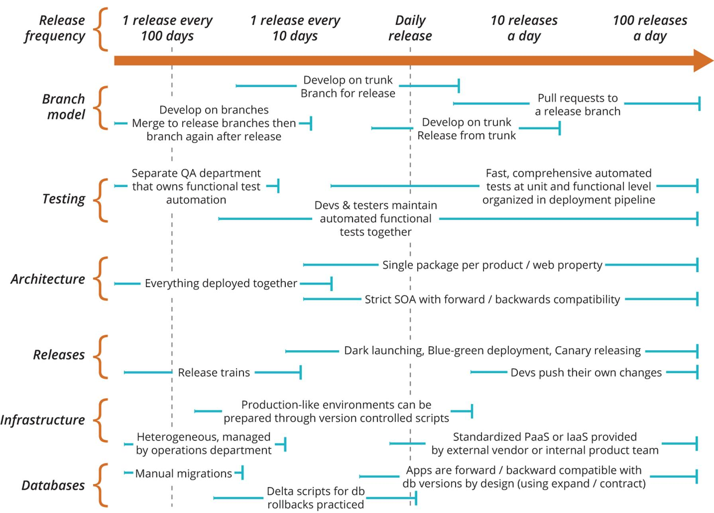

# Git

---

<!-- Connection -->

# Questions

* What other VCS have you used?
* Why use Git?
* Why does Git have a staging area?

---

<!-- Concept -->

# Anatomy of a Git

*Images from Rachel M. Carmena: https://rachelcarmena.github.io/2018/12/12/how-to-teach-git.html*

---

### Distributed VCS

---

### Cloning a repo

---

### Making changes in the working directory

---

### Updating the remote repository 1/2

---

### Updating the remote repository 2/2

---

### Updating the development environment 1/3

---

### Updating the development environment 2/3

---

### Updating the development environment 3/3

---

<!-- Concrete Practice -->

# Exercise! (in pairs)

* http://bit.do/learngit1

---

---

<!-- Conclusion -->

### Activity: Draw the anatomy

---

<!---

 PART 2

-->

# When things go wrong

---

---

<!-- Connection -->

# Questions  (in pairs)

* What do you get stuck with in Git?

---

<!-- Concept -->

## Destructive commands

* `checkout`
* `reset`

* `gc`

---

`git reflog`

->

`git reset HEAD@{index}`

---

<!-- Concrete Practice -->

---

# Exercise! (in pairs)

* http://bit.do/learngit2

---

<!-- Conclusion -->

# Discussion  (in fours)

* What is one fact you've learned about getting unstuck?

---

<!---

 PART 3

-->

# Rebase vs merge

---

<!-- Connection -->

# Discussion  (in pairs)

* Do you usually use merge or rebase? 
* Why?

---

<!-- Concept -->

# Merging through the medium of LEGO

---

# Merge

* No new commits
* Local changes (merge commit)
* Local changes with conflict

---

# Rebase

* Change local history
* Change shared history (force push)

---

# Feature branch

* rebase vs merge from master

---

# Rebase with conflicts

* Reuse recorded resolution 

`git config --global rerere.enabled 1`

---

<!-- Concrete Practice -->

# Exercise! (in pairs)

* http://bit.do/learngit3

---

<!-- Conclusions -->

# Activity  (in 3s)

* Use the LEGO to show how a rebase or merge happens in Git

---

<!---

 PART 4

-->

# Four modern workflow models

---

<!-- Connection -->

# Activity  (in 3s)

* Draw and show how changes happen in your teams Git repo

---

<!-- Concept -->

# Commit messages

*If applied this commit will...*

`git commit -m 'Add logging to the fizzbuzz'`

---

# Four modern workflow models

* Trunk based
* Feature branch
* GitFlow
* Forking

---

---

<!-- Concrete Practice -->

---

<!-- Conclusion -->

# Activity  (solo)

* Write three facts you've learned on back of index card
* Share one with the whole group