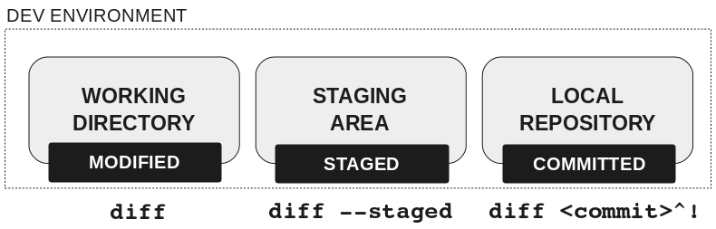
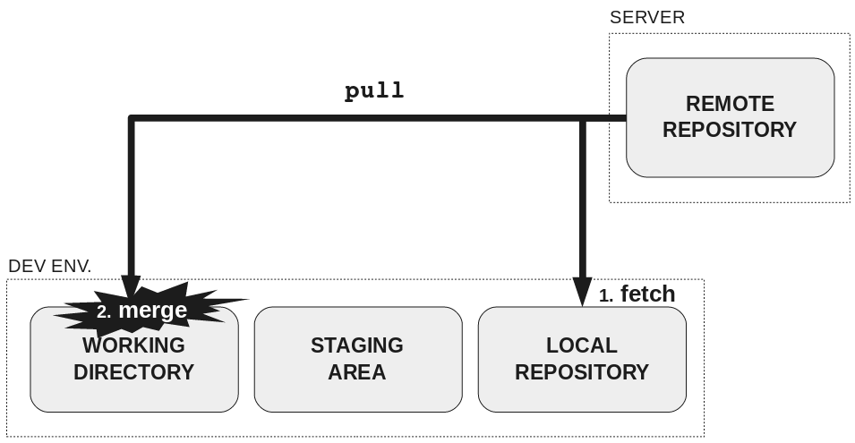

# Questions

* What other VCS have you used?
* Why use Git?
* Why does Git have a staging area?

---

# Anatomy of a Git

*Images from Rachel M. Carmena: https://rachelcarmena.github.io/2018/12/12/how-to-teach-git.html*

---

### Distributed VCS

---

### Cloning a repo

---

### Making changes in the working directory

---

### Updating the remote repository 1/2

---

### Updating the remote repository 2/2

---

### Updating the development environment 1/3

---

### Updating the development environment 2/3

---

### Updating the development environment 3/3

---

# Exercise!

---

### Draw the anatomy

---

reflog
stash
