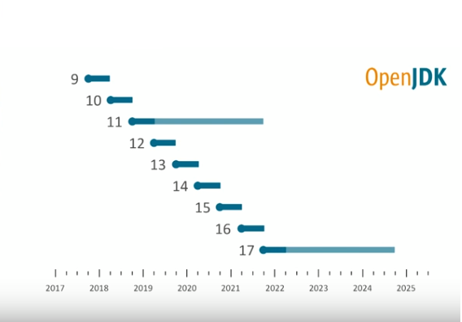

# Java 11 <br /> for Java 8 people

* Language
* Libraries
* Tools

---

## Java Release Schedule



---

# Language Improvements

* Local Variable Type Inference
* Private methods on interfaces
* Module system

---

## Local Variable Type Inference

```
String version = "Java 10";
ByteArrayOutputStream bos = new ByteArrayOutputStream();
```

becomes

```
var version = "Java 10";
var bos = new ByteArrayOutputStream();
```

---

# Advice from C sharp

```
var sb = new StringBuilder(); // Good

var doc = repo.getDocs("base"); // Bad
```

---

## Private methods on interfaces

```
public interface MyInterface {

    void normalInterfaceMethod();

    default void interfaceMethodWithDefault() {  init(); }

    default void anotherDefaultMethod() { init(); }

    private void init() { System.out.println("Initializing"); }
}
```

---

## Module system

`module-info.java`

```
module blog {
  exports com.pluralsight.blog;

  requires cms;
}
```

---

# Libraries

---

## Collection factory methods

Immutable

```
Set<Integer> ints = Set.of(1, 2, 3);
List<String> strings = List.of("first", "second");
Map<String, String> myMap = Map.of(
    "a", "b",
    "c", "d"
);
```

Copying

```
Set.copyOf(someOtherSet);
```

---

## Optionals


*"We should have never called it get(). We should have called it getOrThrowSomethingHorribleIfTheThingIsEmpty()"*

– Brian Goetz, Java Language Architect

---

## Optionals

```
// instead of get()
var someValue = Optional.of("default").orElseThrow(); 

// instead of orElse() orElseGet()
var defaultValue = Optional.of("default");
Optional.of(something).or(() -> defaultValue);

// Streams
Optional.of("a").stream();
```

---

## Steam API additions

```
Stream.of(2, 4, 6, 8, 9, 10, 12)
    .takeWhile(n -> n % 2 == 0)
    .forEach(System.out::println);

// prints out:
// 2 4 6 8

Stream.of(2, 4, 6, 8, 9, 10, 12)
    .dropWhile(n -> n % 2 == 0)
    .forEach(System.out::println);

// prints out:
// 9 10 12
```

---

## HttpClient

Supports HTTP/2 and WebSockets

```
HttpClient client = HttpClient.newHttpClient();

HttpRequest req =
   HttpRequest.newBuilder(URI.create("http://www.google.com"))
              .header("User-Agent","Java")
              .GET()
              .build();

HttpResponse<String> resp = 
  client.send(req, HttpResponse.BodyHandler.asString());
```

---

## String

```
" ".isBlank() // => true
"=".repeat(3) // => "==="

"JD\nJD\nJD".lines().collect(Collectors.toList())

" aa ".strip()         // => "aa"
" aa ".stripLeading()  // => "aa "
" aa ".stripTrailing() // => " aa"
```

---

## Reading & Writing files as string

```
String s = Files.readString(path);
Files.writeString(Paths.get("somepath"), "some_string");
```

---

## Predicates

```
lines.stream()          
     .filter(s -> !s.isBlank())

lines.stream()
     .filter(Predicate.not(String::isBlank))
```

---

## Removed deprecated things

* java.xml.ws 
* java.xml.bind
* java.activation
* java.xml.ws.annotation
* java.corba
* java.transaction
* java.se.ee
* jdk.xml.ws
* jdk.xml.bind

---

# Tooling

---

## Single Java files can be run without compiling

```
java MyRawFile.java
```

```
#!/usr/bin/java --source 11
public class HelloWorld {
}
```

---

## JShell

REPL

---

## JLink

Minimal JVM 

(286Mb -> 39Mb for typical apps)

---

## Garbage

* G1 garbage collector now default - parallel GC
* Epsilon: no-op

---

# Final Notes

* You need to use Gradle 5 to use Java11
* Jabba is nvm for Java