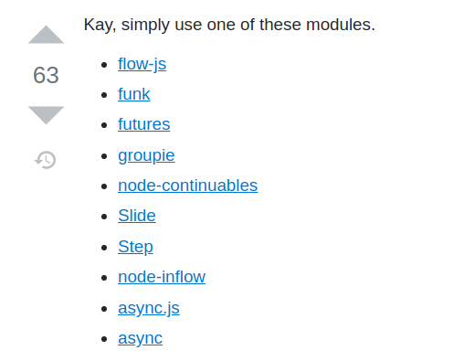

# JS Promises

---

<!-- Connection -->

## What is the difference between concurrency and parallelism?

_discuss in pairs_

---

<!-- Content -->

# How Javascript works

https://www.youtube.com/watch?v=8aGhZQkoFbQ

---

# Blocking example

http://rauschma.github.io/async-examples/blocking.html

---

<!-- Concrete Practice -->

# Exercise!

## (in pairs)

https://github.com/joejag/coaching-plan/tree/master/tech/js/promises

---

<!-- Conclusion -->

### Activity: Draw the event loop

Using your current understanding, draw how the event loop works

---

<!---


 PART 2


-->

<!-- Connection -->

## A

_discuss in pairs_

---

<!-- Content -->

## Callback hell led us to async/await via promises

---

We want

```
x = getData();
y = getMoreData(x);
z = getMoreData(y);
```

We get

```
getData(function(x){
    getMoreData(x, function(y){
        getMoreData(y, function(z){
            ...
        });
    });
});
```

---

## Problems with callbacks

- The code becomes harder to read as you have to move from left to right to understand.
- Error handling is complicated and often leads to bugs.

---

## Libraries were writter



#### https://stackoverflow.com/questions/4234619/how-to-avoid-long-nesting-of-asynchronous-functions-in-node-js

---

## Standardisation happened

```
let promise = new Promise(function(resolve, reject) {
  if(Math.random() > 0.5) {
    resolve('done')
  }
  reject(new Error("bang"))
})

promise
  .then(() => { console.log('yay') })
  .catch(alert)
```

---

# Still problems with Promises

- Cannot use try/catch
- Gotta make a .then for every promise
- Looping over a list of promises is challenging

---

# Async to the resuce

- Syntactical sugar on top of promises.
- No more chaining and reads as synchronous code

---

# Promise version

```
function printAll(){
  printString("A")
  .then(() => printString("B"))
  .then(() => printString("C"))
}
printAll()
```

---

# Async to the resuce

```
async function printAll(){
  await printString("A")
  await printString("B")
  await printString("C")
}
printAll()
```

---

<!-- Concrete Practice -->

# Exercise!

## (in pairs)

https://github.com/joejag/coaching-plan/tree/master/tech/js/promises

---

<!-- Conclusion -->

## Activity: Take turns to explain

### (in rotating pairs)

- How the event loop works in Javascript
- Why you want to use Async/Await over Promises or callbacks
