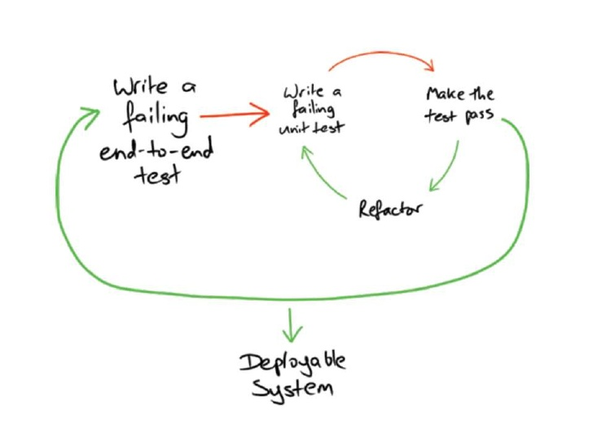

<!--

 __________
< Part one >
 ----------
        \   ^__^
         \  (oo)\_______
            (__)\       )\/\
                ||----w |
                ||     ||

-->

# What are the benefits of TDD?

---

# Outside-In or <br/>Inside-Out TDD

---

# Inside Out

aka...

* Classic TDD
* Detriot School
* Kent Beck Style

---

# Two rules of TDD

* Write only enough of a unit test to fail.
* Write only enough production code to make the failing unit test pass.

---


---

# Outside In

aka ...

* BDD
* London School
* Dan North / Nat Pryce style

---


---



---

# Exercise time!

---

## https://cyber-dojo.org 

Anagrams 

* ```GGvWLe```: TDD
* ```cNR4h3```: BDD & TDD

---

## Activity

* Make a diagram of the BDD and TDD loop

*(on your own)*

---

<!--

 __________
< Part two >
 ----------
        \   ^__^
         \  (oo)\_______
            (__)\       )\/\
                ||----w |
                ||     ||

-->

# Should we aim for 100% test coverage?

---

# Myths and Facts

---

## You don't need to do any upfront design with TDD

---

# Exercise time!

---

## Take a few myths or fact cards

* Talk over them in a pair (8 minutes)
* Be prepared to present your opinion on one <br/>to the room

---

## Activity

* Write down three things you've learned <br/>so far on an index card

*(on your own)*

---

<!--

 __________
< Part three >
 ----------
        \   ^__^
         \  (oo)\_______
            (__)\       )\/\
                ||----w |
                ||     ||

-->

## How often do you run your tests?

---

# Common TDD problems

---

# Not listening to your tests

---

# Not Taking <br/>small steps

---


---

# Triangulate

* Fake it
* Use an obvious solution
* Create a general solution

---

## Fizz Buzz example

---

# Exercise time!

---

## https://cyber-dojo.org 

Bowling Scores 

* ```f9teyY```

---

## Activity

* Teach back what you've learned to another person
* For 90 seconds teach them why they should use smaller steps with TDD

*(in different pairs)*