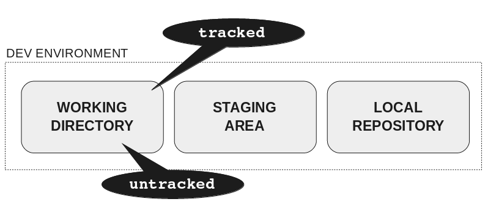

# Intro to VCS

---

<!-- Connection -->

## How do you currently work?

- Draw the process

---

# How and Why of VCS

---

---

## VCS Records Changes

---

## Supports parallel work

---

## Supports parallel work

---

## Questions

- How do you retrieve older versions of your files?
- How do you work on the same file with your colleagues?

---

<!-- Concrete Practice -->

# Exercise!

## (in pairs)

- https://bit.do/vcs1 (until the bit about Proxies)
- Clone a repo from GitLab: https://gitlab.ros.gov.uk
- Look at the repo's history with `git log`

---

<!---

 PART 2

-->

<!-- Connection -->

## What do you know about adding files in Git?

---

<!-- Concept -->

# Anatomy of a Git

_Images from Rachel M. Carmena: https://rachelcarmena.github.io/2018/12/12/how-to-teach-git.html_

---

### Distributed VCS

---

### Cloning a repo

---

### Making changes in the working directory

---

### Updating the remote repository

---

### Updating the development environment

---

<!-- Concrete Practice -->

# Exercise!

## (in pairs)

- (adding) https://bit.do/vcs2
- (fixing) https://bit.do/vcs3 (optional)
- (ignoring) https://bit.do/vcs4 (optional)

---

<!-- Conclusion -->

### Activity: Draw the anatomy

---

<!---

 PART 3

-->

<!-- Connection -->

## What do you know about  Github or Gitlab?

---

# Geting setup with Gitlab

---

# Playing nicely with others

---

## Merging through the medium of Lego

---

# How to avoid merge conflicts

- pull frequently, especially before new work
- make smaller commits
- break large files where two authors are working on them

---

<!-- Concrete Practice -->

# Exercise One

## (in pairs)

- Create a new repo in GitLab
- Push your exercise work to this repo
- Edit a file in the GitLab UI and pull your changes

---

# Exercise Two

## (in two pairs)

- Deliberately create a merge conflict
- Resolve the conflict

---

<!-- Conclusion -->

# Activity  (solo)

- Write three facts you've learned on the back of your index card
- Share one with the whole group

---
